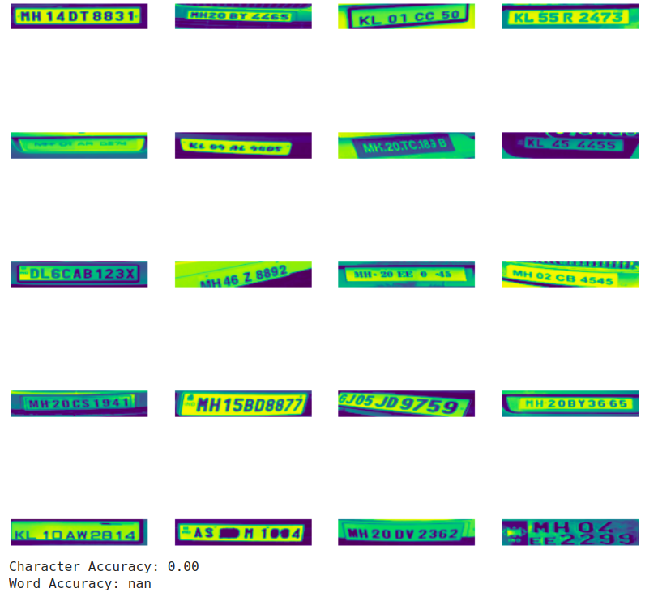
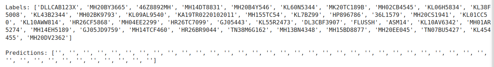

# Part 1 – Basic Implementation

Initially, I experienced some issues with the *trdg* package and I also needed to add some minor changes regarding the import statements (*torch.six*) and the original code (https://github.com/Deepayan137/Adapting-OCR) to avoid some errors (RuntimeError: cuDNN version incompatibility, TypeError: can't convert cuda:0 device type tensor to numpy, etc). Those changes are marked with *#added* on the notebook (notebooks/ocr.ipynb). After running the code successfully, the model performed quite well with a character accuracy of over 96% and a word accuracy above 0.85%.

# Part 2 – Using Our New Data

In this part, I started by creating a dataloader suitable for our dataset. The idea was to reuse some of the original code (*SynthDataset*, which I renamed *CarPlatesDataset*) to return a dictionary with the image, index and label. To do that, the path to the annotations are added, then the xml files are opened, read and the data is converted into a dictionary. Next, we go through each object in the xml data, extract the name field, and add it to a list (*labels*). We then combine the labels from the list into a single string and, finally, return the dictionary with the image, index and label. I also resized the images to avoid any issues with the height and width of the new images. I did not need to change the collator, so it stays as in the original notebook. As for the data splitting, I created a Python script (notebooks/data_split.py) to address this task.

# Part 3 – Training and Evaluation

After running the evaluation on the test set, the results were as bad as they could be:

I double-checked that the dataloader was working successfully (spoiler: it did). I also decided to compute both the labels and predictions, and found out the model was not making any valid prediction for the test set since all the predictions were empty strings.

I learned that I could possibly fix this issue by increasing the training time (some students had had the same issue as they commented so on discord). As a test, I increased the epochs up to 50 and the character accuracy improved (15.80) although it was far from being good. The word accuracy was still really bad (0.00) but at least it was not *nan* anymore.

# Part 4 – Evaluation and Error Analysis

Something that caught my attention was that, when increasing the number of epochs, the number of characters in each predicted label was also higher. That is:

- 4 epocs: no predictions

| Number of epochs | Predictions |
| -------- | -------- |
| 4 (original model) | empty strings |
| 15 | "MH" |
| 50 | "ML20" |
| 100 | "MH0TBX" |

I believe the increase in the number of epochs gives the model more time to learn from the data (each epoch = one pass through the entire dataset), hence it is better at predicting the labels (meaning more characters in the predicted labels). However, a better performance of the model does not only depend on increasing epochs, so I also played around with other hyperparameters.

