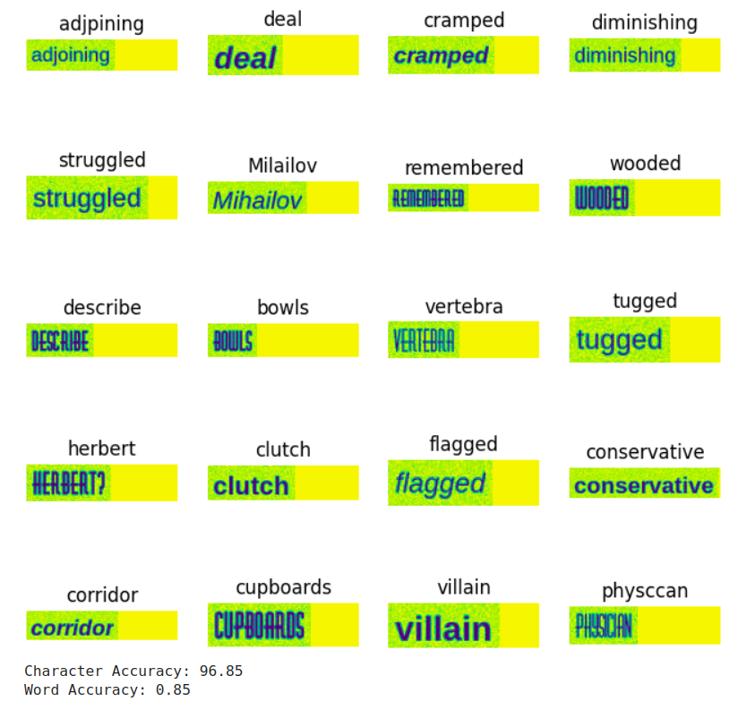

# Part 1 – Basic Implementation

Initially, I experienced some issues with the *trdg* package and I also needed to add some minor changes regarding the import statements (*torch.six*) and the original code (https://github.com/Deepayan137/Adapting-OCR) to avoid some errors (RuntimeError: cuDNN version incompatibility, TypeError: can't convert cuda:0 device type tensor to numpy, etc). Those changes are marked with *#added* on the notebook (notebooks/ocr.ipynb). After running the code successfully, the model performed quite well with a character accuracy of over 96% and a word accuracy above 0.85%.

# Part 2 – Using Our New Data

In this part, I started by creating a dataloader suitable for our dataset. The idea was to reuse some of the original code (*SynthDataset*, which I renamed *CarPlatesDataset*) to return a dictionary with the image, index and label. To do that, the path to the annotations are added, then the xml files are opened, read and the data is converted into a dictionary. Next, we go through each object in the xml data, extract the name field, and add it to a list (*labels*). We then combine the labels from the list into a single string and, finally, return the dictionary with the image, index and label. I also resized the images to avoid any issues with the height and width of the new images. I did not need to change the collator, so it stays as in the original notebook. As for the data splitting, I created a Python script (notebooks/data_split.py) to address this task.

